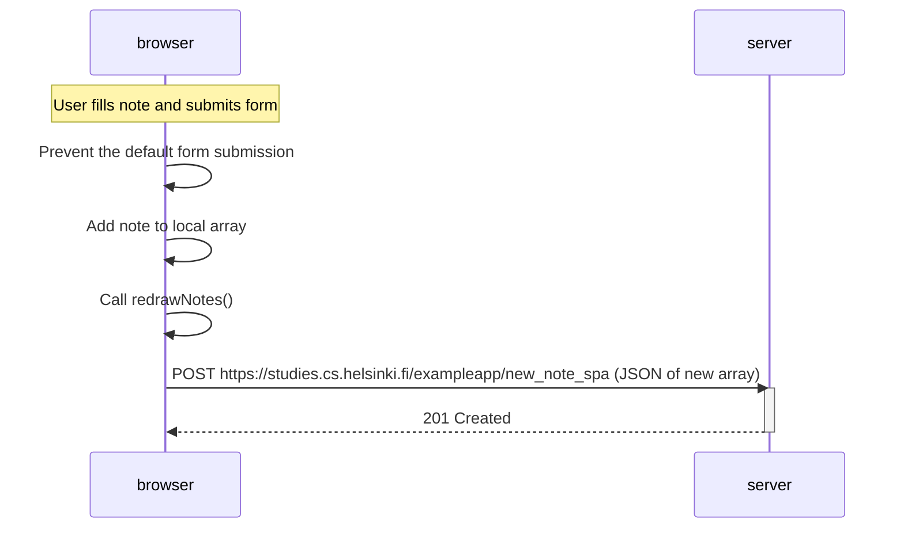

```mermaid
sequenceDiagram
    participant browser
    participant server

    Note over browser: User fills note and submits form

    browser->>browser: Prevent the default form submission
    browser->>browser: Add note to local array
    browser->>browser: Call redrawNotes()

    browser->>server: POST https://studies.cs.helsinki.fi/exampleapp/new_note_spa (JSON of new array)
    activate server
    server-->>browser: 201 Created
    deactivate server
```